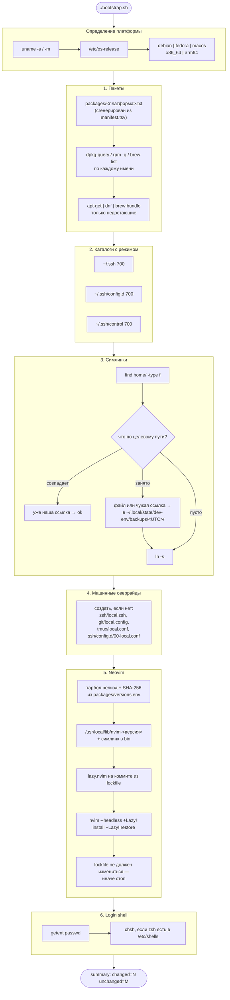

# dev-env

Дотфайлы и bootstrap, который одной командой доводит чистую машину на
Debian/Ubuntu, Fedora или macOS до рабочего окружения — zsh, tmux, git, neovim,
ssh — и при повторном запуске честно сообщает, что менять нечего.

---

## Задача

Окружение разработчика обычно устроено так: полтора года накопленных правок в
`~/.zshrc`, из которых половина скопирована из чужого гиста, а вторая половина
объясняется фразой «без этого что-то ломалось». Дальше происходит одно из трёх.

* **Новая машина.** Настройка занимает вечер, и результат отличается от старой
  машины: часть строк не перенесли, часть перенесли, но пакет с тех пор
  переименовали.
* **Ломающая правка.** Кто-то добавил строку в `.zshrc`, shell стал стартовать
  700 мс, и никто этого не заметил, потому что никто никогда не измерял.
* **Установщик, который стирает.** Классический `install.sh` из репозитория с
  дотфайлами делает `ln -sf`, то есть молча удаляет то, что уже лежало по
  целевому пути. Один раз этого достаточно.

Репозиторий закрывает это четырьмя вещами.

1. **Одна команда.** `./bootstrap.sh` на голом образе доводит систему до
   состояния, в котором работают shell, редактор и мультиплексор.
2. **Идемпотентность доказывается.** Скрипт считает изменения и печатает
   `summary: changed=N unchanged=M`. Второй прогон обязан дать `changed=0`, и
   это проверяется в контейнере, а не обещается в README.
3. **Ничего не затирается.** Файл, который уже лежит по целевому пути,
   переезжает в датированный бэкап, и путь печатается. Симлинк, который смотрел
   не туда, — тоже: он мог быть единственной ссылкой на чей-то файл.
4. **Скорость измеряется.** У каждого решения про «ленивую» загрузку есть
   число, полученное запуском, а не прилагательное.

---

## Что внутри

| Компонент | Что настроено |
|---|---|
| [zsh](home/.config/zsh) | Без фреймворка. Восемь модулей с фиксированным порядком загрузки, XDG-раскладка через `ZDOTDIR`, кешированный `compinit` со скомпилированным дампом, промпт с `vcs_info` без `check-for-changes`, два своих fzf-виджета, пять функций |
| [tmux](home/.config/tmux/tmux.conf) | Только встроенные опции: `escape-time 10`, truecolor через `terminal-overrides`, сплиты наследуют каталог, vi-режим копирования, статус-строка без часов и графиков |
| [git](home/.config/git/config) | `useConfigOnly` — коммит без явной личности невозможен; `zdiff3`, `colorMoved`, `rerere`, `pull.ff=only`, `fetch.prune`, глобальный `ignore` только для артефактов машины |
| [neovim](home/.config/nvim) | Lua-конфигурация, четыре плагина, зафиксированные `lazy-lock.json`; LSP через встроенный `vim.lsp.config`; treesitter только на парсерах из поставки |
| [ssh](home/.ssh/config) | Мультиплексирование с `%C`-хешем в `ControlPath`, `IdentitiesOnly`, `HashKnownHosts`, `Include` машинных настроек **первым** |
| [пакеты](packages/manifest.tsv) | Один манифест, из которого генерируются `debian.txt`, `fedora.txt` и `Brewfile` |

---

## Архитектура

`bootstrap.sh` — это шесть стадий, каждая из которых сначала читает состояние
машины и только потом что-то делает. Отсюда и берётся счётчик изменений: стадия
не может сообщить `changed`, не изменив ничего на самом деле.



Порядок не произвольный. Пакеты идут первыми, потому что на голом образе нет ни
`curl`, ни `git`, ни `zsh` — без них не выполнить ни одну следующую стадию.
Симлинки идут раньше Neovim, потому что `nvim --headless` должен прочитать уже
подключённый `~/.config/nvim`. Login shell меняется последним: если что-то
упало раньше, у оператора остаётся работающий вход в систему.

---

## Решения и компромиссы

### POSIX sh, а не Ansible

Соблазн переиспользовать локальный коннектор Ansible был — в соседнем
репозитории уже лежит парк ролей, и `ansible-playbook -c local` дал бы
идемпотентность из коробки, `--check` и нормальные модули вместо `mv` руками.

Не выбрано по одной причине: **на момент запуска на машине ещё ничего нет**.
Ansible — это Python, pip и десяток зависимостей, то есть перед первой задачей
плейбука нужен bootstrap для самого bootstrap-а. `debian:12-slim` не содержит
даже `curl`. `/bin/sh` есть везде, включая macOS, где это bash в POSIX-режиме, и
Alpine, где это busybox ash.

Что за это заплачено, честно:

* **Идемпотентность пишется руками.** У Ansible она в модулях; здесь каждая
  функция обязана сначала спросить состояние и только потом действовать. Именно
  поэтому счётчик изменений — не украшение вывода, а единственный механизм,
  который позволяет это проверить.
* **Нет `--check`.** Сухой прогон пришлось бы писать отдельно, и он стоил бы
  примерно столько же, сколько сам скрипт. Вместо него — второй прогон, который
  ничего не меняет и печатает это.
* **Нет `local`.** Он не в POSIX; переменные функций именуются с префиксом
  функции, и это заметно многословнее. Взамен ShellCheck гоняется в режиме
  `--shell=sh`, то есть отлавливает bash-измы до того, как скрипт доедет до
  macOS.

### Никакого zsh-фреймворка

oh-my-zsh и prezto решают три задачи: набор плагинов, менеджер плагинов и набор
готовых настроек. Первая здесь решается двумя пакетами дистрибутива, вторая —
поэтому не нужна, третья — это как раз то, что хочется писать самому.

Цена фреймворка измерена, а не оценена. Полный список — в разделе «Метрики»;
коротко: конфигурация целиком стоит **20 мс** сверх голого zsh, и из них
**12 мс** — это два плагина, которые реально используются каждый день.

Дороже всего в старте zsh не плагины, а `compinit`: он обходит весь `$fpath` и
`stat`-ит каждый файл, чтобы решить, можно ли доверять кешу. На Debian 12 это
**48.7 мс** против **23.6 мс**, если проверять свежесть дампа раз в сутки
(`compinit -C`) и держать дамп скомпилированным (`zcompile`). Это не
«оптимизация ради оптимизации»: 25 мс — половина времени старта.

Что сознательно не сделано: **отложенная загрузка через `zsh-defer` или
собственные шимы**. Она имеет смысл, когда в старте висит `eval "$(pyenv init
-)"` или `nvm.sh` — там речь о сотнях миллисекунд. Здесь таких потребителей
нет, а шим, подменяющий команду и переопределяющий сам себя при первом вызове,
ломает `command -v` и путает всё, что проверяет наличие бинарника. Механика на
100 строк ради экономии, которой не будет.

### Симлинки, а не копирование и не GNU Stow

| | симлинки (выбрано) | копирование | GNU Stow |
|---|---|---|---|
| Правка конфига видна в репозитории | сразу | после явного «импорта» | сразу |
| Легко понять, откуда файл | `ls -l` показывает цель | никак | `ls -l` показывает цель |
| Работает без зависимостей | да | да | нужен perl и сам stow |
| Файл уже есть по целевому пути | обрабатывается явно | обрабатывается явно | `stow` падает с конфликтом |
| Гранулярность | файл | файл | каталог |

**Копирование** отпало из-за петли обратной связи. Правка `.zshrc` в живой
системе — это правка того файла, который shell читает; при копировании она
делается в одном месте, а проверяется в другом, и рано или поздно репозиторий
начинает отличаться от того, что реально работает. Симлинк делает эти два
места одним.

**Stow** отпал из-за гранулярности. Он линкует каталоги целиком, пока не
встретит конфликт, и тогда разворачивает симлинк в реальный каталог с
симлинками внутри («folding»/«unfolding»). Для `~/.ssh`, где рядом с
`config` лежат приватные ключи, которых в репозитории нет и не будет, это
означает, что каталог всегда развёрнут, а поведение зависит от того, что ещё в
нём есть. Плюс это ещё одна зависимость на машине, где `perl` может
отсутствовать.

Линкуются **файлы, а не каталоги**, и список берётся обходом `home/` — то есть
добавление нового конфига не требует правки никакого манифеста. Обратная
сторона: симлинк на каталог автоматически подхватывал бы новые файлы, созданные
внутри него самим приложением; здесь такой файл останется невидимым для
репозитория, пока его туда не положат руками. Для конфигурации это правильное
поведение, для кеша — неважное.

### Что происходит, когда по целевому пути уже что-то есть

Это единственная часть установщика дотфайлов, которую стоит обсуждать всерьёз,
потому что ошибка здесь необратима.

Правила:

1. **Наш симлинк с правильной целью** — ничего не делать, засчитать `ok`.
2. **Обычный файл или каталог** — переместить в
   `~/.local/state/dev-env/backups/<UTC-метка>/<исходный путь>` и напечатать
   куда. Не удалить, не перезаписать, не переименовать в `.bak` рядом.
3. **Симлинк, указывающий не туда** — то же самое. Это отдельный случай, потому
   что `[ -e ]` для битого симлинка ложно, и наивная проверка «существует ли
   файл» его не заметит, а `ln -sf` молча его заменит. Битый симлинк — часто
   единственное упоминание пути, который человек ещё собирался восстановить.
4. **Ничего нет** — создать родительский каталог и слинковать.

Каталог бэкапа создаётся **лениво**, при первом реальном перемещении. Иначе
каждый прогон оставлял бы пустой датированный каталог, и через месяц в
`backups/` было бы тридцать пустых папок — тест на это тоже есть.

Чего эта схема не покрывает: если сам `~/.config` окажется симлинком на другой
каталог, файлы уедут туда, и скрипт этого не заметит. Обрабатывать такой случай
означало бы резолвить каждый компонент пути и решать за пользователя, что он
имел в виду; вместо этого случай назван здесь.

### Секреты и машинные различия: два разных порядка включения

Ни одна строка в репозитории не должна зависеть от конкретной машины. Механизм
один — файл-оверрайд, который создаётся пустым при bootstrap и никогда не
трекается:

| Файл | Кто читает | Порядок |
|---|---|---|
| `~/.config/zsh/local.zsh` | `.zshrc`, последней строкой | последний выигрывает |
| `~/.config/git/local.config` | `[include]` **в конце** `config` | последний выигрывает |
| `~/.config/tmux/local.conf` | `source-file -q` в конце | последний выигрывает |
| `~/.ssh/config.d/*.conf` | `Include` **в начале** `config` | **первый** выигрывает |

Разница в последней строке — не опечатка и не мелочь. Git для однозначного
ключа запоминает **последнее** прочитанное значение, поэтому `[include]` обязан
стоять внизу файла: наверху он был бы молча перекрыт всем, что ниже. OpenSSH,
наоборот, для каждого ключевого слова запоминает **первое** совпадение, поэтому
`Include ~/.ssh/config.d/*.conf` стоит первой строкой — иначе `Host *` из
трекаемого файла закрыл бы любой машинный `Host`. Оба порядка проверяются
тестом, а не комментарием: в контейнере в оверрайды дописываются значения, и
проверяется, что победили они.

Отдельно про личность в git. В трекаемом `config` нет ни имени, ни адреса —
вместо этого стоит `user.useConfigOnly = true`. Git тогда отказывается
собирать личность из `$USER` и имени хоста и падает на первом коммите с
внятным сообщением. Альтернатива — забыть заполнить `local.config` и обнаружить
через неделю сотню коммитов от `root@buildbox`.

### Neovim: тарбол релиза, а не пакет дистрибутива

Debian 12 поставляет Neovim 0.7. Эта конфигурация использует `vim.lsp.config`
(0.11), `vim.uv`, `vim.hl.on_yank` и `opt.winborder` — на 0.7 она не
загрузится вообще. Fedora 41 достаточно свежа, но конфигурация, работающая на
одной из двух поддерживаемых платформ, — это не конфигурация.

Поэтому на любом Linux ставится тарбол релиза с проверкой SHA-256 из
`packages/versions.env`, распаковывается в **версионированный** каталог
`/usr/local/lib/nvim-<версия>`, и `/usr/local/bin/nvim` — симлинк на него.
Откат — это правка одной переменной, а не повторная выкачка. На macOS — Homebrew,
который и так тянется Brewfile-ом.

Честная оговорка про контрольные суммы: **апстрим для этого релиза не публикует
файл с суммами**. Значения в `versions.env` посчитаны с загруженных артефактов и
зафиксированы. Это trust on first use: оно защищает от подмены ассета
после фиксации и не заменяет подпись. Скрипт при несовпадении удаляет
скачанный файл и падает, а не «докачивает».

### Плагины Neovim: четыре штуки и lockfile

Плагины: `lazy.nvim` (менеджер), `fzf-lua`, `gitsigns.nvim`, `oil.nvim`,
`conform.nvim`. Каждый должен объяснять, что он делает такого, чего нет в
редакторе.

Чего сознательно **нет**:

* **`nvim-treesitter`.** Он компилирует парсеры на каждой машине, то есть
  требует C-компилятора там, где его могло не быть, и превращает первый запуск
  в сборку. Neovim с 0.10 поставляется с парсерами для `c`, `lua`, `vim`,
  `vimdoc`, `query` и `markdown` — ровно тех языков, на которых написана сама
  конфигурация. Подсветка для них включается автокомандой в четыре строки; тест
  проверяет, что на `init.lua` highlighter действительно прицепился.
* **`nvim-lspconfig`.** С 0.11 в ядре есть `vim.lsp.config` и `vim.lsp.enable`,
  а lspconfig стал в основном каталогом готовых определений. Четыре сервера с
  тремя строками настроек между ними не стоят зависимости, в которой их
  тысяча. Единственная нетривиальная логика — сервер включается, только если
  его бинарник есть на машине: включённый сервер, который не может стартовать,
  ругается на каждом подходящем буфере.
* **`telescope.nvim`.** Проиграл `fzf-lua` по одной причине: фильтрация в
  telescope идёт на Lua в UI-потоке, а у `fzf-lua` — в процессе fzf. На
  репозитории в сотню тысяч файлов это разница между рабочим пикером и
  подтормаживающим. Цена — нужен бинарник `fzf`, который в манифесте всё равно
  есть ради shell.
* **Плагина с цветовой схемой.** Neovim с 0.10 везёт `retrobox` и ещё
  несколько; отдельный репозиторий ради палитры — это обновление, ломающееся в
  самый неудобный момент.

Версии зафиксированы в `lazy-lock.json`, и — это главное — **редактор никогда
не ставит плагины сам**: в конфигурации `install.missing = false`, checker
выключен, change detection выключен. Ставит только bootstrap, командой
`+Lazy! install +Lazy! restore`. Открытие редактора в самолёте не превращается
в попытку сходить в сеть.

`lazy.nvim` не может зафиксировать сам себя — он должен оказаться на диске до
того, как прочитает lockfile. Поэтому его коммит вычитывается из lockfile
скриптом (`sed`, а не `jq`: bootstrap не должен зависеть от парсера JSON) и
выставляется `git checkout` перед первым запуском редактора.

И последнее: после прогона bootstrap **сверяет контрольную сумму lockfile** и
падает, если lazy его переписал. Lockfile — это вход, а не выход; если прогон
его меняет, то две машины, настроенные с разницей в неделю, поедут на разных
ревизиях плагинов. Тест проверяет байтовое совпадение с исходником.

### Свои fzf-виджеты вместо `key-bindings.zsh`

fzf поставляет готовый файл с биндингами для Ctrl-R и Ctrl-T. Он не
подключается, и причина не в объёме.

Этот файл сохраняет **весь набор опций** через `setopt` в начале и
восстанавливает его через `eval` в конце. В интерактивном shell без терминала —
а это ровно то, как shell запускают бенчмарк и тесты (`zsh -i -c exit`) —
восстановление пытается включить опцию `zle` после старта, zsh отказывается, и
каждый такой shell печатает предупреждение. Плюс путь к файлу различается на
каждом дистрибутиве.

Два виджета на двенадцать строк делают то же самое: Ctrl-R через `fc -rln 1`
(флаг `-n` убирает номера событий, поэтому парсить вывод не нужно), Ctrl-T через
`fd`/`fdfind` с `(q)`-квотированием имени файла. Ноль вендоренного кода и
предсказуемое поведение. Тест `interactive zsh starts silently` существует
именно из-за этой истории.

### Пакеты: один манифест вместо трёх списков

`packages/manifest.tsv` — таблица «инструмент → имя в apt → имя в dnf → формула
Homebrew». Из неё генерируются `debian.txt`, `fedora.txt` и `Brewfile`;
`gen-packages.sh --check` падает, если сгенерированное разошлось с манифестом,
и это гоняется в CI и внутри контейнерного теста.

Три списка, поддерживаемых руками, расходятся в течение месяца: кто-то добавил
`ripgrep` в Debian, забыл Fedora, и разница всплывает на машине, которую ещё
никто не настраивал. Манифест делает такую ошибку невыразимой.

Побочная польза — видно, где имена расходятся, и это не абстрактный пример:
`openssh-client` против `openssh-clients`, `fd-find` в обоих дистрибутивах, но
в Debian бинарник называется `fdfind` (алиас в `aliases.zsh` это чинит),
`diffutils` в Fedora не установлен в базовом образе вообще — это выяснилось
падением теста, а не рассуждением.

### Что сознательно не управляется

* **GPG- и SSH-ключи.** Ключ нельзя ни сгенерировать за человека (получится
  ключ без парольной фразы, о котором он не знает), ни положить в репозиторий.
  Bootstrap создаёт `~/.ssh` с режимом 700 и `config.d/` для машинных Host-ов —
  и на этом останавливается.
* **Железо и всё, что от него зависит.** Раскладка, DPI, шрифты терминала,
  профили питания. Это настройки конкретной машины, у них нет общего
  значения по умолчанию, и попытка их описать закончится списком исключений
  длиннее самого списка.
* **Локали.** Устанавливать `locales` на Debian бессмысленно без `locale-gen`,
  а `glibc-langpack-en` на Fedora работает сразу — то есть «одинаковая»
  настройка на самом деле разная. Вместо этого `.zshenv` ставит `LANG=C.UTF-8`,
  только если `LANG` пуст: glibc отдаёт `C.UTF-8` без генерации с версии 2.35,
  этого достаточно для корректной работы с многобайтовыми символами, а реальная
  локаль от десктопной сессии всегда выигрывает.
* **Менеджер плагинов tmux (tpm).** В конфигурации нет ни одной опции, которой
  не было бы в самом tmux. Плагин-менеджер ради этого — механика без нагрузки.
* **Апдейты.** Ни `apt upgrade`, ни `brew upgrade` bootstrap не делает.
  Скрипт, который приводит машину в описанное состояние, и скрипт, который
  обновляет систему, — разные скрипты с разным профилем риска.

### Честный предел: macOS

**macOS здесь не тестируется.** Ветки для него написаны — `brew list` для
проверки пакетов, `brew bundle` для установки, `shasum -a 256` вместо
`sha256sum`, `stat -f '%Lp'` вместо `stat -c '%a'`, `ls -G` вместо
`--color=auto`, отказ трогать login shell (`chsh` на macOS требует
интерактивного ввода пароля, и делать это молча из bootstrap хуже, чем сказать
об этом). Но ни одна из них не проходила через CI, потому что в контейнере
macOS не поднять.

Что это значит на практике: **поддержка macOS — best effort**. Утверждение
«работает на Debian 12 и Fedora 41» подкреплено 37 проверками на каждом образе
при каждом изменении. Утверждение «должно работать на macOS» подкреплено только
чтением документации. Разница между этими двумя утверждениями и есть причина,
по которой они написаны разными словами.

---

## Метрики

Все числа получены запуском `scripts/bench-zsh.sh` внутри контейнера, 50
измерений на конфигурацию, 5 прогревочных отброшено. Измеряется время
`zsh -i -c exit` — то есть разбор rc-файлов и всё, что они подключают.

zsh 5.9 на обоих образах, x86_64:

| Конфигурация | Debian 12, мс | Fedora 41, мс | Что в ней |
|---|---|---|---|
| `floor` | 3.2 | 13.4 | пустой rc: сколько стоит сам zsh на этой машине |
| `naive` | 48.7 | 47.5 | те же модули, но `compinit` с полной проверкой на каждом старте и без `zcompile` |
| `no-plugins` | 11.9 | 23.3 | конфигурация без `zsh-autosuggestions` и `zsh-syntax-highlighting` |
| `shipped` | 23.6 | 34.2 | то, что ставит `bootstrap.sh` |

Что из этого читается:

* **Кеширование `compinit` экономит 25.1 мс на Debian и 13.3 мс на Fedora** —
  48.7 → 23.6 и 47.5 → 34.2. Это единственная строчка в конфигурации, у которой
  цена сопоставима со всем остальным вместе взятым.
* **Два плагина стоят 11.7 мс на Debian и 10.9 мс на Fedora** (23.6 − 11.9 и
  34.2 − 23.3). Они остаются: автодополнение по истории и подсветка команды до
  нажатия Enter экономят больше времени, чем 12 мс на старте.
* **Вся конфигурация стоит около 20 мс сверх голого zsh** на обеих системах
  (20.4 и 20.8). Разница в абсолютных числах между дистрибутивами — это `floor`:
  Fedora читает системные rc-файлы, которых в образе Debian нет.

Чего этот бенчмарк **не** измеряет:

* **Отрисовку промпта.** `zsh -i -c exit` не рисует ни одного промпта, поэтому
  хуки `precmd` — а значит и `vcs_info` — не выполняются ни разу. Это правильное
  число для «сколько ждать до первого ввода» и неправильное для «сколько между
  Enter и следующим промптом». Именно поэтому `check-for-changes` у `vcs_info`
  выключен по рассуждению (это `git status` перед каждым промптом), а не по
  измерению — измерить это тем же способом нельзя.
* **Первый старт после установки.** `compinit` в первый раз строит дамп
  полностью, и `zcompile` ещё не отработал. Бенчмарк отбрасывает 5 прогревочных
  запусков именно поэтому: интересно установившееся состояние.
* **Реальный терминал.** Числа получены в контейнере без tty, на конкретной
  машине. Абсолютные значения зависят от железа; воспроизводимо здесь
  соотношение между вариантами.

Повторить:

```bash
make bench            # debian:12-slim, RUNS=50
RUNS=200 make bench   # больше измерений
```

---

## Проверка

Контейнерный тест — это то, чем этот репозиторий отличается от любого другого
набора дотфайлов. Он не проверяет, что файлы на месте; он запускает shell,
редактор и tmux и спрашивает у них, что получилось.

```bash
make test                    # debian:12-slim и fedora:41
make test-debian
make test-fedora
```

На каждом образе `tests/suite.sh` делает следующее.

1. **Подкладывает мины.** Обычный файл по пути `~/.config/tmux/tmux.conf` и
   симлинк `~/.zshenv → /dev/null`. Оба должны пережить установку.
2. **Гоняет bootstrap end-to-end** на голом образе: пакеты ставятся, тарбол
   Neovim скачивается и проверяется, плагины разворачиваются с lockfile,
   login shell меняется.
3. **Проверяет поведение, 37 утверждений.** Не «файл существует», а:

   | Что спрашивается | Как |
   |---|---|
   | Интерактивный zsh стартует без единого предупреждения | stderr от `zsh -i -c exit` должен быть пустым |
   | Плагины zsh реально загрузились | `$+functions[_zsh_autosuggest_start]`, `$+functions[_zsh_highlight]` |
   | Дамп автодополнения скомпилирован | `.zwc` появился рядом с дампом |
   | Функции работают | `mkcd` создаёт и заходит, `up 2` из `/usr/share/zsh` даёт `/usr` |
   | `local.zsh` перекрывает трекаемое | в оверрайд дописывается переменная, shell её отдаёт |
   | Neovim загружает конфигурацию | stderr от `nvim --headless +qa` пуст |
   | Опции применились | `vim.o.shiftwidth` == 4, `mapleader` == пробел |
   | Все плагины на диске и на ревизии из lockfile | `lazy.plugins()` + `git rev-parse HEAD` |
   | Bootstrap не переписал lockfile | `cmp` с исходником |
   | Treesitter из поставки прицепился | `vim.treesitter.highlighter.active[buf]` на `init.lua` |
   | tmux разобрал конфиг | `new-session` не напечатал ни строки, `escape-time` == 10, `prefix` == `C-a` |
   | git отказывается коммитить без личности | `git commit` падает; после записи в `local.config` — проходит |
   | ssh применил дефолты и уступил оверрайду | `ssh -G -T`: `serveraliveinterval 30`, затем `port 2222` из `config.d` |
   | Файл, лежавший по целевому пути, цел | содержимое найдено в каталоге бэкапа |
   | Битый симлинк цел | `readlink` бэкапа даёт исходную цель |
   | Списки пакетов не разошлись с манифестом | `gen-packages.sh --check` |

4. **Запускает bootstrap второй раз.** Вот его вывод целиком, с `debian:12-slim`
   (стадии, где всё совпало, печатают одну строку `ok` на объект — здесь они
   свёрнуты):

   ```
   dev-env  platform=debian arch=x86_64 home=/root

   ==> Packages (debian)
   ==> Directories
   ==> Dotfiles
   ==> Machine-local overrides
   ==> Neovim
   ==> Neovim plugins
   ==> Login shell

   summary: changed=0 unchanged=52
     pass  the second run changes nothing
     pass  the second run creates no new backup directory
   ```

   Первый прогон на том же образе даёт `summary: changed=49 unchanged=3` — то
   есть счётчик не заклинил на нуле, он действительно считает. На Fedora 41:
   `changed=48 unchanged=4` и затем `changed=0 unchanged=52`.

5. **Меряет старт zsh** и печатает таблицу из раздела «Метрики».

Репозиторий монтируется в контейнер **только на чтение** — это дешёвый способ
гарантировать, что bootstrap пишет в `$HOME` и в кеш, и больше никуда.

### Линтеры

```bash
make lint          # всё сразу
make lint-sh       # ShellCheck
make lint-lua      # StyLua --check
make packages-check
```

ShellCheck гоняется в режиме `--shell=sh` — то есть bash-измы отлавливаются как
ошибки, а не как «на моей машине работает». Файлы из `lib/` не перечислены явно:
они не имеют смысла в отрыве от `bootstrap.sh` и подтягиваются через директивы
`# shellcheck source=`, а `--check-sourced` заставляет ShellCheck сообщать и об
их проблемах тоже. Локально, если самого ShellCheck нет, скрипт запускает
закреплённый образ `koalaman/shellcheck:v0.11.0`.

StyLua скачивается по версии и SHA-256 из `packages/versions.env` в `.cache/bin`,
поэтому одна и та же версия форматтера работает локально и в CI, и новый релиз
апстрима не может сам по себе покрасить пайплайн в красный.

`luacheck` **не** подключён. Он требует Lua и LuaRocks на машине, а поймал бы
здесь ровно одно — необъявленные глобальные переменные в конфигурации, у которой
единственная глобальная переменная называется `vim`. Контейнерный тест ловит это
надёжнее: он загружает конфигурацию в настоящем Neovim и падает на любой ошибке.

---

## Запуск

```bash
git clone https://github.com/lpogosu/dev-env.git ~/src/github.com/lpogosu/dev-env
cd ~/src/github.com/lpogosu/dev-env
./bootstrap.sh
```

Всё. Скрипт сам определит платформу, поставит недостающие пакеты, разложит
симлинки, поставит Neovim с плагинами и переключит login shell.

Флаги для частичного прогона (на безопасность они не влияют — каждая стадия и
так проверяет состояние перед действием, флаги влияют только на время):

```bash
./bootstrap.sh --no-packages   # пакеты уже стоят
./bootstrap.sh --no-plugins    # без Neovim и плагинов
./bootstrap.sh --no-shell      # не трогать login shell
```

Дальше — заполнить машинные оверрайды, которые скрипт создал пустыми:

```bash
$EDITOR ~/.config/git/local.config    # без этого git откажется коммитить
$EDITOR ~/.config/zsh/local.zsh
$EDITOR ~/.ssh/config.d/00-local.conf
```

Ничего из этого репозиторий не трекает.

Прочие цели:

```bash
make help
make packages      # перегенерировать списки пакетов из manifest.tsv
make nvim-lock     # обновить lazy-lock.json в контейнере
make clean         # удалить .cache
```

---

## Структура

```
dev-env/
├── bootstrap.sh                 # единственная точка входа
├── lib/
│   ├── log.sh                   # вывод и счётчик изменений
│   ├── platform.sh              # определение ОС/архитектуры, sudo, sha256, режим файла
│   ├── links.sh                 # симлинки, бэкапы, машинные оверрайды
│   ├── packages.sh              # запрос состояния и установка пакетов
│   └── neovim.sh                # тарбол по SHA-256 и восстановление плагинов по lockfile
├── packages/
│   ├── manifest.tsv             # единственный источник правды
│   ├── debian.txt               # сгенерировано
│   ├── fedora.txt               # сгенерировано
│   ├── Brewfile                 # сгенерировано
│   └── versions.env             # версии и контрольные суммы того, что не из дистрибутива
├── home/                        # то, что раскладывается по $HOME один в один
│   ├── .zshenv
│   ├── .config/
│   │   ├── zsh/                 # .zshrc + 8 модулей
│   │   ├── tmux/tmux.conf
│   │   ├── git/{config,ignore}
│   │   └── nvim/                # init.lua, lua/config/, lua/plugins/, lazy-lock.json
│   └── .ssh/config
├── scripts/
│   ├── gen-packages.sh          # генерация и --check
│   ├── bench-zsh.sh             # бенчмарк старта zsh
│   ├── lint-sh.sh               # ShellCheck
│   └── lint-lua.sh              # StyLua по закреплённой версии
├── tests/
│   ├── run.sh                   # запуск сьюта в контейнере на каждый образ
│   ├── suite.sh                 # 37 проверок + два прогона bootstrap + бенчмарк
│   └── bench/                   # варианты конфигурации для сравнения
│       ├── floor/               # пустой rc
│       ├── naive/               # полный compinit на каждом старте
│       └── no-plugins/          # без двух zsh-плагинов
├── Makefile
├── stylua.toml
└── .github/workflows/ci.yml     # линтеры + матрица из двух образов
```

---

## Лицензия

MIT — см. [LICENSE](LICENSE).
